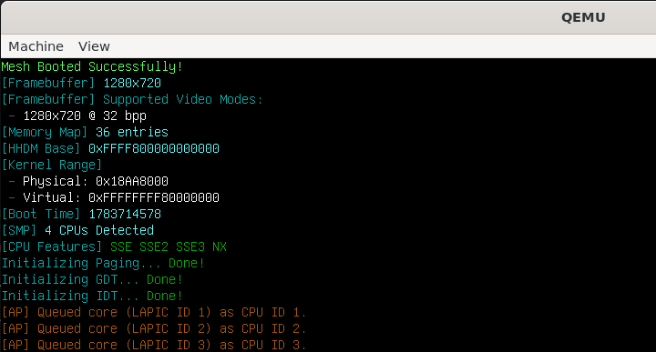

[Mesh](https://github.com/Sid110307/Mesh) is a freestanding x86_64 kernel written in C++ and x86 assembly. It boots
through Limine, replaces the bootloader-provided page tables, installs its own descriptor and interrupt tables,
configures the local and I/O APICs, starts additional processors and enters an interrupt-driven idle loop.

This post follows that initialization path in execution order. It focuses on the boundaries where the firmware,
bootloader, CPU state, and kernel code meet. It is not a general introduction to x86 OS dev. I want to document how
these components currently fit together in Mesh.

The implementation here is still kernel infrastructure rather than a complete operating system. User processes,
syscalls, filesystems, storage drivers, etc. are not yet implemented.



*Mesh running under QEMU with four virtual CPUs.*

## Establishing the boot contract with Limine

Before Mesh can initialize its own memory manager or interrupt controllers or anything, it needs an environment in which it was loaded. The kernel obtains this info through the [Limine boot protocol](https://github.com/limine-bootloader/limine-protocol/blob/trunk/PROTOCOL.md).

Limine takes care of the firmware part of the boot process and starts Mesh in 64-bit mode. It also provides
responses containing the physical memory map, framebuffer information, ACPI root pointer, kernel load addresses, etc.

Mesh declares the information it needs as request structs:

```c
#include <core/limine.h>

__attribute__((used, section(".limine_requests")))
volatile struct limine_framebuffer_request framebuffer_request = {
    .id = LIMINE_FRAMEBUFFER_REQUEST,
    .revision = 0
};

__attribute__((used, section(".limine_requests")))
volatile struct limine_memmap_request memmap_request = {
    .id = LIMINE_MEMMAP_REQUEST,
    .revision = 0
};

__attribute__((used, section(".limine_requests")))
volatile struct limine_hhdm_request hhdm_request = {
    .id = LIMINE_HHDM_REQUEST,
    .revision = 0
};

__attribute__((used, section(".limine_requests")))
volatile struct limine_executable_address_request
executable_addr_request = {
    .id = LIMINE_EXECUTABLE_ADDRESS_REQUEST,
    .revision = 0
};

__attribute__((used, section(".limine_requests")))
volatile struct limine_mp_request mp_request = {
    .id = LIMINE_MP_REQUEST,
    .revision = 0
};

__attribute__((used, section(".limine_requests")))
volatile struct limine_date_at_boot_request date_at_boot_request = {
 .id = LIMINE_DATE_AT_BOOT_REQUEST,
 .revision = 0
};

__attribute__((used, section(".limine_requests")))
volatile struct limine_rsdp_request rsdp_request = {
    .id = LIMINE_RSDP_REQUEST,
    .revision = 0
};

__attribute__((used, section(".limine_requests")))
volatile struct limine_executable_file_request executable_file_request = {
 .id = LIMINE_EXECUTABLE_FILE_REQUEST,
 .revision = 0
};

__attribute__((used, section(".limine_requests")))
volatile struct limine_module_request module_request = {
 .id = LIMINE_MODULE_REQUEST,
 .revision = 0
};
```

*Source: [`src/core/limine.c`](https://github.com/Sid110307/Mesh/blob/master/src/core/limine.c)*

Each structure has an identifier according to the protocol and the response pointer. The response pointer is initially 0. At boot, Limine finds the requests in the kernel image, then processes them before entering the kernel.

### Information requested

The requests are used by different parts of the kernel:

| Request                 | Information provided                                         | Used by                                 |
|-------------------------|--------------------------------------------------------------|-----------------------------------------|
| framebuffer_request     | Address, dimensions, pitch and pixel format                  | Framebuffer renderer                    |
| memmap_request          | Usable, reserved, ACPI and bootloader-owned physical regions | Physical frame allocator                |
| hhdm_request            | Offset of the higher-half direct mapping                     | Page-table and MMIO access              |
| executable_addr_request | Physical and virtual kernel load bases                       | Kernel section remapping                |
| mp_request              | CPU count, LAPIC IDs and AP startup records                  | SMP init                                |
| date_at_boot_request    | Timestamp supplied during boot                               | Diagnostic output                       |
| rsdp_request            | ACPI root-system-description pointer                         | MADT and interrupt-controller discovery |
| executable_file_request | Loaded kernel-file metadata                                  | Boot information and diagnostics        |
| module_request          | Files loaded alongside the kernel                            | Future module or filesystem support     |

Not every response is required immediately. For example, `module_request` is present even though there is no userland
image loaded or any filesystem implemented.

### The higher-half direct map

One of the most important responses is the HHDM offset:

```c
volatile struct limine_hhdm_request hhdm_request = {
    .id = LIMINE_HHDM_REQUEST,
    .revision = 0
};
```

It provides a virtual region in which physical memory is mapped with a fixed offset. Within that region, a physical
address can be converted to a kernel virtual address using:

```cpp
virtualAddress = physicalAddress + hhdmOffset;
```

This relationship is used when accessing page tables and memory-mapped hardware. For example, when allocating a physical frame
for a new page table, the kernel adds the HHDM offset to it and clears or updates the table using a virtual pointer.

The reverse conversion is:

```cpp
physicalAddress = virtualAddress - hhdmOffset;
```

This is used when a virtual pointer to a page table must be written as a physical frame address into another paging
structure.

It maps the physical memory directly while the kernel page tables and VMM define other regions for the heap, dynamically allocated virtual memory, MMIO and kernel stack.

### Physical and virtual kernel addresses

Mesh is linked as a higher-half kernel. Its linker script places the kernel at:

```text
0xFFFFFFFF80000000
```

The address supplied by the executable-address response allows the kernel to calculate the difference between its linked
virtual address and the physical location at which it was loaded:

```cpp
const uint64_t kernelDelta =
    executable_addr_request.response->virtual_base
    - executable_addr_request.response->physical_base;
```

A linked virtual address can then be converted to its corresponding physical address:

```cpp
physicalAddress = virtualAddress - kernelDelta;
```

This becomes important when Mesh replaces the bootloader-provided page tables. The kernel must recreate mappings for its
own `.text`, `.rodata`, `.data` and `.bss` sections before loading the new top-level page table into `CR3`.

The executable-address request therefore connects two otherwise separate views of the kernel:

```text
Linked virtual address
        │
        │ subtract kernelDelta
        ▼
Loaded physical address
```

### Multiprocessor records

The multiprocessor request provides one record for each processor made available by the bootloader. On x86_64, these
records include:

* the processor identifier;
* the local APIC identifier;
* an entry-point field for starting the processor;
* an additional argument passed to that entry point.

Mesh uses this information to identify the bootstrap processor and prepare the remaining application processors.

```c
volatile struct limine_mp_request mp_request = {
    .id = LIMINE_MP_REQUEST,
    .revision = 0
};
```

The bootstrap processor performs the initial kernel setup. For every other processor, Mesh prepares an AP-specific stack
and logical CPU identifier, stores that information in the record's additional-argument field, and assigns an assembly
trampoline to its startup entry point.

The details of that process are covered later in the SMP section.

### ACPI discovery

The RSDP request gives Mesh the starting point for parsing ACPI tables:

```c
volatile struct limine_rsdp_request rsdp_request = {
    .id = LIMINE_RSDP_REQUEST,
    .revision = 0
};
```

From the Root System Description Pointer, the kernel locates either the RSDT or XSDT and searches for the Multiple APIC
Description Table. The MADT describes the interrupt-controller topology, including I/O APICs and interrupt-source
overrides.

This information is required before the kernel can correctly route the PS/2 keyboard interrupt through the I/O APIC.

Providing the RSDP through the boot protocol avoids embedding firmware-specific ACPI discovery logic in the early entry
path. Parsing and validating the ACPI tables remains the kernel's responsibility.

### The kernel still validates the responses

Declaring a request does not guarantee that a valid response will be returned. A request may be unsupported, malformed
or unavailable on a particular system.

Kernel code must therefore check the response pointer before using it:

```cpp
if (memmap_request.response)
    Renderer::printf("[Memory Map] %u entries\n", memmap_request.response->entry_count);
```

For essential resources such as the physical memory map or HHDM, initialization shouldn't proceed without a valid
response.

### Boot configuration

The Limine configuration identifies the kernel executable and requests a framebuffer mode:

```ini
timeout: 0
default_entry: Mesh

/Mesh
protocol: limine
path: boot():/mesh.elf
resolution: 1280x720x32
```

*Source: [`lib/limine.conf`](https://github.com/Sid110307/Mesh/blob/master/lib/limine.conf)*

Limine loads `mesh.elf`, processes the request structures and enters the executable at its declared entry point. The
requested resolution is used when a compatible mode is available, but kernel code must still use the dimensions and
pitch which is in the framebuffer response.

```text
┌───────────────────┐
│ BIOS or UEFI      │
└─────────┬─────────┘
          │ boot
          ▼
┌───────────────────┐
│ Limine bootloader │
│                   │
│ * loads mesh.elf  │
│ * finds requests  │
│ * fills responses │
│ * provides CPUs   │
│ * provides HHDM   │
└─────────┬─────────┘
          │ _start
          ▼
┌───────────────────┐
│ Kernel            │
│                   │
│ * validate data   │
│ * init renderer   │
│ * rebuild paging  │
│ * configure APICs │
│ * start  APs      │
└───────────────────┘
```

Limine hence acts as a boundary between firmware startup and kernel init. Mesh doesn't need to implement the transition
from real mode (32-bit) to long mode (64-bit). Its work begins after that using the information supplied through the
boot protocol.

## Entering the kernel

After Limine has loaded `mesh.elf`, processed the boot-protocol requests and established a 64-bit environment, control
is transferred to the kernel's ELF entry point.

The linker script declares `_start` as that entry point:

```ld
ENTRY(_start)
```

*Source: [`lib/linker.ld`](https://github.com/Sid110307/Mesh/blob/master/lib/linker.ld)*

As Limine has already performed the earlier boot transition and loaded the kernel according to its ELF layout, `_start`
does not have to do anything extra.

```nasm
bits 64

section .text
    global _start
    extern kernelMain

_start:
    lea rsp, [rel stack_top]
    call kernelMain

.hang:
    hlt
    jmp .hang

section .bss
    align 16

stack_bottom:
    resb 16384

stack_top:
```

*Source: [`src/asm/boot.asm`](https://github.com/Sid110307/Mesh/blob/master/src/asm/boot.asm)*

The purpose of `_start` is only:

1. establish a known bootstrap stack
2. transfer control into the C++ kernel
3. prevent execution from continuing unpredictably if the C++ entry point returns

### Establishing the bootstrap stack

The first instruction initializes the stack pointer:

```nasm
lea rsp, [rel stack_top]
```

`stack_top` marks the address immediately after a 16 KiB region reserved in `.bss`:

```nasm
stack_bottom:
    resb 16384

stack_top:
```

Because the stack grows toward lower addresses, execution begins with `rsp` pointing to the upper end of the reserved
region.

```text
Higher address

        stack_top
            │
            ▼
┌─────────────────────────────┐
│                             │
│     16 KiB bootstrap        │
│          stack              │
│                             │
└─────────────────────────────┘
            ▲
            │
       stack_bottom

Lower address
```

The bootstrap stack is used only during the early kernel path. Later there are separate stacks for additional
processors, per-CPU interrupt handling and kernel tasks.

Using a kernel-owned stack before entering C++ avoids relying on the bootloader's stack, which may be unsuitable.

### Why `lea` uses a relative address

The instruction uses [RIP-relative](https://stackoverflow.com/a/36952302) addressing:

```nasm
lea rsp, [rel stack_top]
```

In 64-bit mode, `rel` instructs NASM to encode the address relative to the current instruction pointer rather than an
absolute immediate address.

This is useful because `_start` and `stack_top` are both part of the loaded kernel image. Their relative displacement is
fixed by the linker even though the kernel's final address is selected during boot.

The instruction calculates the virtual address of `stack_top` during runtime and stores it in `rsp`.

### Transferring control to C++

I chose C++ instead of staying in C for most of the later implementation because it gets easier to reuse code with OOP
and templates as I'm not limited to small constraints. The entry point is still a simple assembly stub.

Once the stack is established, the entry point calls the kernel's C-linkage function:

```nasm
call kernelMain
```

The corresponding declaration is:

```cpp
extern "C" [[noreturn]] void kernelMain()
```

The `extern "C"` linkage is required because the function is referenced directly by assembly. Without it, the C++
compiler would emit a mangled symbol name which would mess up the naming. It expects the exact symbol `kernelMain`
rather than `_Z10kernelMainv` or similar.

### What `call` places on the stack

The `call` instruction performs two operations:

1. it pushes the address of the instruction after `call`;
2. it transfers control to `kernelMain`.

Conceptually:

```text
Before call:

rsp -> top of bootstrap stack

After call:

rsp -> return address
       previous stack contents
```

### Stack alignment

The System V AMD64 ABI defines stack-alignment requirements for function calls. The stack should
be [aligned](https://stackoverflow.com/a/49397524) so that the function begins with the expected relationship between
`rsp` and a 16-byte boundary.

The static stack region is aligned:

```nasm
section .bss
    align 16
```

and its size is also a multiple of 16 bytes:

```nasm
resb 16384
```

Therefore, `stack_top` is aligned to 16 bytes. The `call` instruction then pushes an 8-byte address before entering
`kernelMain()`.

The resulting entry condition is:

```text
stack_top % 16 = 0

after call:
rsp % 16 = 8
```

### The fallback loop

If `kernelMain()` returns (despite being declared `[[noreturn]]`, if a fatal error occurs), execution continues at:

```nasm
.hang:
    hlt
    jmp .hang
```

`hlt` stops instruction execution until an interrupt, NMI, SMI or reset occurs.

### Why the entry point contains no C runtime setup

Mesh is compiled as a freestanding program. There is no hosted C or C++ runtime available before `kernelMain()`.

The entry point does not invoke a standard `main()` function, libc startup code, argc/argv parsing, or anything else.

The kernel is built with options such as:

```text
-ffreestanding
-fno-exceptions
-fno-rtti
-nostdlib
-static
```

As a result, the kernel must provide or avoid facilities that normal application programs receive from the operating
system and language runtime.

In the present boot model, the code relies on the environment supplied by Limine for the earliest transition into
`kernelMain()`. Processor features, paging, descriptor tables, interrupt handling, and other services are initialized
later.

### Global constructors

Mesh currently uses global objects, including spinlocks, atomic counters and scheduler arrays. Many of these objects
either use static zero-initialization or have simple constructors.

However, the entry path does not contain an explicit mechanism for walking `.init_array` and invoking global C++
constructors.

It is not required just because the kernel is written in C++, but it's needed once the code starts to depend on
non-trivial static object construction.

```cpp
using Constructor = void (*)();

extern Constructor __init_array_start[];
extern Constructor __init_array_end[];

void runGlobalConstructors()
{
    for (Constructor* constructor = __init_array_start; constructor != __init_array_end; ++constructor)
        (*constructor)();
}
```

The linker script would also need to retain the constructor array:

```ld
.init_array : ALIGN(8) {
    __init_array_start = .;
    KEEP(*(.init_array .init_array.*))
    __init_array_end = .;
}
```

## Initialization order

Once `_start` has established the bootstrap stack, control enters `kernelMain()`.

```cpp
extern "C" [[noreturn]] void kernelMain()
{
    initRenderer();
    initSIMD();
    Renderer::setSerialPrint(true);
    dumpStats();

    initPaging();
    initGDT();
    initIDT();
    SMP::init();
    LAPIC::init(SMP::getLapicBase());

    if (!CPUManager::initCPU(0, mp_request.response->bsp_lapic_id))
        Panic::panic("Failed to initialize primary CPU.");
    if (!CPUManager::initRuntime(0))
        Panic::panic("Failed to initialize primary CPU runtime.");

    initIOAPIC();
    Keyboard::init();
    initLapicTimer();

    Interrupt::enableInterrupts();
    while (true)
    {
        Keyboard::service();
        while (char c = Keyboard::readChar())
            Renderer::printf("%c", c);

        static uint64_t last = 0;
        if (const uint64_t now = LAPIC::timerGetTicks(); now / 1000 != last / 1000)
        {
            Renderer::printf("\x1b[90m.\x1b[0m");
            last = now;
        }

        asm volatile("hlt");
    }
}
```

*Source: [`src/core/kernel.cpp`](https://github.com/Sid110307/Mesh/blob/master/src/core/kernel.cpp)*

The order is not arbitrary. Reordering these calls without understanding those dependencies can cause faults before the
kernel has enough data to report what failed.

The current sequence can be divided into six phases:

1. Boot diagnostics
2. Processor-state preparation
3. Memory ownership
4. Interrupt and CPU structures
5. Device interrupt routing
6. Interrupt runtime

### Phase 1: Boot diagnostics

The first subsystem initialized is the framebuffer renderer:

```cpp
initRenderer();
```

The renderer consumes the framebuffer response previously supplied by Limine. It initializes font and framebuffer state,
clears the display and provides formatted text output for the rest of the boot process.

Initializing output first is a debugging decision as most following stages interact with privileged processor state or
memory-mapped hardware. A failure during paging, GDT, IDT, or APIC init may not show any indication of where execution
stopped.

The first boot message (`Mesh Booted Successfully!`) doesn't mean that the entire kernel has initialized successfully.
At this point, it has only reached its C++ entry point and initialized the framebuffer output path.

#### Serial output

After [SIMD setup](#phase-2-prepare-the-processor-for-compiled-kernel-code), framebuffer output is mirrored to the
serial console for debugging:

```cpp
Renderer::setSerialPrint(true);
```

Serial output is useful because it remains observable through QEMU's terminal even when the framebuffer is no longer
updating correctly.

The QEMU run target connects the serial device to the host terminal:

```text
-serial mon:stdio
```

### Phase 2: Prepare the processor for compiled kernel code

The next call is:

```cpp
initSIMD();
```

Despite its name, the function does more than prepare optional vector arithmetic. It configures processor state expected
by modern x86_64 code.

```cpp
void initSIMD()
{
    SMP::detectCPUFeatures();
    if (!SMP::getCPUFeatures().hasSSE)
    {
        Renderer::printf("\x1b[31mCPU does not support SSE.\x1b[0m\n");
        return;
    }

     uint64_t cr0, cr4;

    asm volatile ("mov %%cr0, %0" : "=r"(cr0));
    cr0 &= ~(1ULL << 2);
    cr0 |= (1ULL << 1) | (1ULL << 5);
    asm volatile ("mov %0, %%cr0" :: "r"(cr0));

    asm volatile ("mov %%cr4, %0" : "=r"(cr4));
    cr4 |= (1ULL << 9) | (1ULL << 10);
    asm volatile ("mov %0, %%cr4" :: "r"(cr4));

    asm volatile ("fninit");
}
```

*Source: [`src/core/kernel.cpp`](https://github.com/Sid110307/Mesh/blob/master/src/core/kernel.cpp)*

The control-register changes perform the following operations:

| Register bit         | Effect                                                                    |
|----------------------|---------------------------------------------------------------------------|
| `CR0.EM = 0`         | Disables software emulation of floating-point instructions                |
| `CR0.MP = 1`         | Enables correct interaction between `WAIT/FWAIT` and task-switching state |
| `CR0.NE = 1`         | Enables native x87 floating-point exception reporting                     |
| `CR4.OSFXSR = 1`     | Allows the operating system to use `FXSAVE`, `FXRSTOR` and SSE state      |
| `CR4.OSXMMEXCPT = 1` | Enables SIMD floating-point exception delivery                            |

Reference: [Intel 64 and IA-32 Architectures Software Developer’s Manual, Volume 3A: System Programming Guide, Part 1](https://www.intel.com/content/dam/www/public/us/en/documents/manuals/64-ia-32-architectures-software-developer-vol-3a-part-1-manual.pdf)

Finally, `fninit` initializes the x87 FPU to a known state.

The compiler flags include `-mgeneral-regs-only`. This tells the compiler not to use floating-point or vector registers
for normal generated code. That reduces the amount of SIMD state that must be configured during boot.

Even with that compiler option, explicitly preparing the processor state is still useful because the kernel may later
use SSE in handwritten code, memory-management routines, task context management, etc. and it should not completely
depend on the bootloader having done that work.

#### Printing the boot environment

After the renderer and serial channel are available, Mesh prints information supplied by Limine and discovered through
`CPUID`:

```cpp
dumpStats();
```

The diagnostic dump occurs before Mesh replaces the active page tables. This is useful because it records the addresses
and memory information that will be used during the transition. This also confirms that the bootloader responses are
accessible before the memory manager begins relying on them.

### Phase 3: Take ownership of memory management

The first major subsystem initialized after diagnostics is paging:

```cpp
initPaging();
```

The helper function exposes the dependency chain within the memory subsystem:

```cpp
void initPaging()
{
    Renderer::printf("\x1b[36mInitializing Paging... ");
    if (!FrameAllocator::init()) Panic::panic("Failed to initialize FrameAllocator.");
    if (!Paging::init()) Panic::panic("Failed to initialize Paging.");
    if (!VMM::init()) Panic::panic("Failed to initialize VMM.");
    if (!BuddyAllocator::init()) Panic::panic("Failed to initialize BuddyAllocator.");
    if (!SlabAllocator::init()) Panic::panic("Failed to initialize SlabAllocator.");
    Renderer::printf("\x1b[32mDone!\n");
}
```

The order within `initPaging()` is itself constrained:

```text
Limine memory map
        │
        ▼
Physical frame allocator
        │
        ▼
Kernel page tables
        │
        ▼
Virtual memory manager (VMM)
        │
        ▼
Buddy allocator
        │
        ▼
Slab allocator
```

#### Physical frame allocator first

The frame allocator identifies and tracks usable physical 4 KiB frames. Page-table creation depends on it because every
new page-table level requires a physical frame.

Without a frame allocator, `Paging::init()` would have no general mechanism for obtaining memory for the PML4, PDPT,
page-directory or page-table structures.

#### Paging before the VMM

The paging layer creates mappings between virtual and physical addresses and activates the
kernel-owned [PML4](https://wiki.osdev.org/X86_Paging).

The VMM operates at a higher level. It manages virtual address regions such as kernel heap, dynamic memory, MMIO
regions, kernel stacks, etc. It therefore requires an operational page-mapping layer underneath it.

#### Buddy allocator

The [buddy allocator](https://en.wikipedia.org/wiki/Buddy_memory_allocation) manages larger blocks in page units.
The [slab allocator](https://en.wikipedia.org/wiki/Slab_allocation) then subdivides memory into smaller fixed-size
objects.

This leads to the allocation hierarchy:

```text
Physical frames
      │
      ▼
Buddy blocks
      │
      ▼
Slab pages
      │
      ▼
Small kernel objects
```

Task structures and VMM metadata later depend on slab allocation. Therefore, task and per-CPU runtime initialization
must occur after this entire memory chain is ready.

### Phase 4: Install processor control structures

Once the memory subsystem is available, Mesh installs
the [Global Descriptor Table](https://wiki.osdev.org/Global_Descriptor_Table).

```cpp
initGDT();
```

followed by the [Interrupt Descriptor Table](https://wiki.osdev.org/Interrupt_Descriptor_Table):

```cpp
initIDT();
```

The GDT defines the code and data selectors referenced by IDT entries and task-state segments. The IDT then maps
exception and interrupt vectors to their handlers.

The bootstrap processor's GDT initialization also prepares its TSS:

```cpp
GDTManager::setTSS(0, reinterpret_cast<uint64_t>(&kernelStacks[0][SMP::SMP_STACK_SIZE]));
GDTManager::loadTR(0);
```

The IDT registers the external interrupt vectors:

```cpp
IDTManager::setEntry(0x21, isrKeyboard, 0x8E, 0);
IDTManager::setEntry(0x22, isrTimer, 0x8E, 0);
IDTManager::setEntry(0x80, isrYield, 0x8E, 0);
```

Installing an IDT does not itself begin interrupt delivery. If interrupts were enabled before valid handlers and
controller routes existed, a timer or keyboard event could enter an undefined vector.

#### SMP discovery precedes LAPIC initialization

After the descriptor tables are available, Mesh initializes its multiprocessor topology:

```cpp
SMP::init();
```

This stage determines the local APIC base and prepares application-processor startup information.

Only after that does the bootstrap processor initialize its local APIC:

```cpp
LAPIC::init(SMP::getLapicBase());
```

The local APIC is required for timer interrupts, interprocessor interrupts, and End-of-Interrupt signalling.

The additional processors may already have been directed toward their entry paths during `SMP::init()`. The bootstrap
processor still requires its own CPU structure and runtime state before timer-driven scheduling begins.

#### Initializing the bootstrap processor's per-CPU state

The bootstrap processor is assigned logical CPU ID `0`:

```cpp
CPUManager::initCPU(0, mp_request.response->bsp_lapic_id);
```

This initializes the per-CPU structure and associates it with the bootstrap processor's LAPIC ID.

The next call initializes runtime state:

```cpp
CPUManager::initRuntime(0);
```

The runtime function assigns the per-CPU scheduler, creates an idle task and marks the processor online.

This must occur after:

* the slab allocator, because task metadata is dynamically allocated
* the VMM, because task stacks require virtual memory
* the GDT, because the CPU needs a valid TSS
* SMP discovery, because LAPIC and logical CPU identity are now known

It must occur before:

* the LAPIC timer begins producing scheduler ticks
* interrupts are enabled
* the scheduler interrupt handler attempts to retrieve the current CPU

### Phase 5: Route external interrupts

With paging, the IDT and the bootstrap processor's local APIC available, Mesh initializes
the [I/O APIC](https://wiki.osdev.org/IOAPIC):

```cpp
initIOAPIC();
```

The function performs several dependent operations.

In order to detect the existence of an I/O APIC (or multiple ones), the Intel Multi-Processor or ACPI tables (
specifically, the MADT) must be parsed. In the MP tables, configuration tables with the entry identification of `0x01`
are for I/O APICs. Parsing will tell how many I/O APICs exist, what are their APIC IDs, base MMIO address and first IRQ.
The MADT also contains entries for interrupt-source overrides, which are used to remap legacy ISA interrupts to global
system interrupts.

The keyboard interrupt is routed through the I/O APIC rather than the legacy PIC. For this, the kernel must map the MMIO
region, resolve the ISA interrupt, create a redirection entry in the I/O APIC, and mask the legacy PIC.

The MMIO mapping requires the paging subsystem:

```cpp
const uint64_t ioapicVirt = madt.ioapicPhys[i] + hhdm_request.response->offset;
if (!Paging::map(
        ioapicVirt,
        madt.ioapicPhys[i],
        FrameAllocator::SMALL_SIZE,
        PageFlags::PRESENT |
        PageFlags::RW |
        PageFlags::CACHE_DISABLE |
        PageFlags::WRITE_THROUGH |
        PageFlags::GLOBAL |
        PageFlags::NO_EXECUTE))
{
    Renderer::printf("\x1b[31mFailed to map IOAPIC %d MMIO.\x1b[0m\n", i);
    return;
}
```

The keyboard route requires both the IDT and bootstrap processor LAPIC ID:

```cpp
ACPI::resolveIsa(
    madt,
    1,
    globalIrq,
    activeLow,
    levelTriggered
);
IOAPIC::redirect(
    globalIrq,
    0x21,
    lapicId,
    activeLow,
    levelTriggered
);
```

Finally, the legacy programmable interrupt controllers are masked:

```cpp
outb(0x21, 0xFF);
outb(0xA1, 0xFF);
```

This prevents duplicate or conflicting delivery through the older PIC path.

#### Initializing the keyboard before enabling interrupts

After its I/O APIC route is installed, the keyboard driver is initialized:

```cpp
Keyboard::init();
```

Now, the IDT contains the keyboard vector and the I/O APIC contains the route, but maskable interrupts are still
globally disabled through the processor's interrupt flag. This allows device initialization to complete without racing
the first IRQ.

#### Initializing the [LAPIC timer](https://wiki.osdev.org/APIC_Timer)

The final interrupt source configured before `sti` is the local APIC timer:

```cpp
initLapicTimer();
```

The timer setup is:

```cpp
void initLapicTimer()
{
    Renderer::printf("\x1b[36mInitializing LAPIC Timer... ");

    LAPIC::timerInit(0x22);
    LAPIC::timerSetDivide(16);
    LAPIC::timerCalibrate(10);
    LAPIC::timerPeriodic();

    CPUManager::getCurrentCPU()->timerReady = true;
    Renderer::printf("\x1b[32mDone!\x1b[0m\n");
}
```

The timer is assigned IDT vector `0x22`, calibrated and placed in periodic mode.

### Phase 6: Enable interrupt delivery

Only after all handlers, controller routes and runtime state are available, the kernel enables interrupt delivery:

```cpp
Interrupt::enableInterrupts();
```

This sets the processor's interrupt flag, using `sti`.

From this point onward, the bootstrap processor can receive:

* PS/2 keyboard interrupts through the I/O APIC
* LAPIC timer interrupts
* CPU exceptions
* software-yield interrupts
* interprocessor interrupts

#### Entering the steady-state loop

After interrupt delivery is enabled, `kernelMain()` enters its final loop:

```cpp
while (true)
{
    Keyboard::service();
    while (char c = Keyboard::readChar()) Renderer::printf("%c", c);

    static uint64_t last = 0;
    if (const uint64_t now = LAPIC::timerGetTicks(); now / 1000 != last / 1000)
    {
        Renderer::printf("\x1b[90m.\x1b[0m");
        last = now;
    }

    asm volatile ("hlt");
}
```

The loop services keyboard characters and prints a dot every second to test the timer.

The `hlt` instruction avoids continuous waiting. Because interrupts have already been enabled, the processor resumes
when an interrupt occurs.

## Current state and next steps

At the end of the boot sequence, Mesh is running with kernel-owned page tables, descriptor tables, interrupt routing,
per-CPU state and a periodic LAPIC timer. The bootstrap processor can receive keyboard and timer interrupts, and
additional processors are brought online with their own stacks and runtime structures.

The implementation is still kernel infrastructure rather than a complete OS as it doesn't have any user processes,
independent address spaces, syscalls, executable loading, filesystems, device drivers, or anything similar. Scheduling
is currently focused on kernel threads, and full task switching is not yet implemented.
